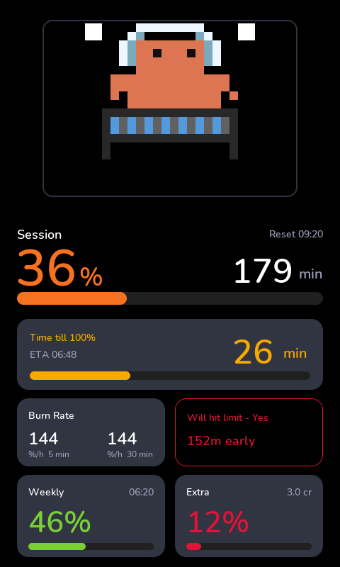

# esphome-modular-lvgl-buttons

[](https://opensource.org/licenses/MIT)
[](https://esphome.io)
[](https://www.home-assistant.io/)

A modular component library for building touchscreen smart home control panels using [ESPHome](https://esphome.io/) + [LVGL](https://lvgl.io/) on cheap ESP32 displays.

See [ARCHITECTURE.md](ARCHITECTURE.md) for the full design rationale.

---

## ⭐ What's new in this fork

This is a fork. Lineage and what each layer adds:

| Layer | Repo | Adds |
|---|---|---|
| **Base** | [agillis/esphome-modular-lvgl-buttons](https://github.com/agillis/esphome-modular-lvgl-buttons) | The modular tile library: light, switch, sensor, binary_sensor, text_sensor, button, sensor_button, climate + the flip-clock / weather / solar / tides feature modules. |
| **+ Derek's features** | [derekmcauley7/esphome-modular-lvgl-buttons](https://github.com/derekmcauley7/esphome-modular-lvgl-buttons) | **`media_player`** entity (remote-only): transport controls, volume, progress bar, full-screen detail page, optional PIN lock. |
| **+ This fork** | you are here | **🐾 [Clawdmeter](#-clawdmeter)** — animated Claude-usage display · **🌍 4-language i18n** (en/de/fr/es) for Clawdmeter · **🛫 Runway** burn-vs-reset projection · **🖼 Pace frame** colour-coded breathing runway border (grid layouts) · **🎨 Modern multi-format layouts** (`classic`/`modern` page-1 look, nine pixel-tuned resolutions). Bumped to ESPHome **2026.6.0**. |

So everything in the base library **and** Derek's `media_player` is included here —
this fork only **adds** the Clawdmeter stack on top.

### 🐾 Clawdmeter

An animated pixel-art creature that shows your **Claude token usage**: the
creature's mood tracks how fast you're burning tokens, and a stats panel below
draws session / weekly / extra usage bars, burn rate, time-to-100 %, reset
clocks and a "Runway" verdict. On the modular grid layouts the creature tile can
also wear a colour-coded, breathing **pace frame** that turns the Runway pace
into a green → orange → red status border.

<p align="center">
  <br>
  <sub><i>The "Modern Dark" layout (480×800) — one of nine pixel-tuned modern formats. SDL preview render.</i></sub>
</p>

> **Data source required.** The Clawdmeter reads usage from **Home Assistant
> sensors** — it does not scrape Claude itself. You need a producer for those
> sensors: either the
> [trickv/hass-claude-usage](https://github.com/trickv/hass-claude-usage)
> integration **or your own implementation** (any HA template/REST/MQTT sensor
> exposing the same usage % + reset-timestamp values).

- 📖 **[ui/clawdmeter/README.md](ui/clawdmeter/README.md)** — data flow (where
  the entities come from, what the device computes, when which animation is
  shown) + full file/variable reference.
- 🧩 **Two ways to build it:** an **all-in-one** single include (compact,
  resolution-agnostic, five HA entities) or a **modular grid** of tiles (full
  metric set + Runway line + pace frame). See the
  [comparison](ui/clawdmeter/README.md#all-in-one-vs-modular-grid).
- 🎨 **Two looks, nine formats:** a `classic` creature-and-panel layout or the
  **`modern`** dark-card design — the latter pixel-tuned for **320×240, 320×480,
  480×272, 480×480, 480×800, 720×720, 720×1280, 800×480 and 800×1280** (the
  320×240 a compact reduced variant) — picked with a single `design:`
  substitution. See [Designs and multi-format layouts](ui/clawdmeter/README.md#designs-and-multi-format-layouts).
- 🚀 Ready-to-flash examples in
  [`example_code/clawdmeter/`](example_code/clawdmeter/) — sorted into
  [`all-in-one/`](example_code/clawdmeter/all-in-one/) and
  [`grid/`](example_code/clawdmeter/grid/).

---

## How it works

Each entity type lives in `ui/<type>/` and provides:

```
ui/<type>/local.yaml    — tile for an ESPHome component on the same device
ui/<type>/remote.yaml   — tile for a Home Assistant entity
ui/<type>/detail.yaml   — full-screen detail page (complex types only)
```

Your device YAML composes a panel by including one hardware file, the shared infrastructure, and one `!include` per tile. Everything internal (globals, scripts, detail page) is wired automatically.

---

## Installation

This library is a folder of `!include` building blocks. Your device YAML pulls
them in by the literal path `esphome-modular-lvgl-buttons/...`, so the **whole
repo has to live inside your ESPHome config directory**, right next to your
device YAML and `secrets.yaml`. It is a **local folder, not a remote
`packages:` source** — pointing `packages:` at the GitHub URL will *not* work,
because the internal includes resolve relative to your config directory.

Target layout, however you get the files there:

```text
/config/esphome/                     ← your ESPHome dashboard config dir
├── esphome-modular-lvgl-buttons/    ← THIS repo, cloned/copied as a whole folder
├── secrets.yaml                     ← wifi + lat/lon
└── my-panel.yaml                    ← your device config (a copy of an example)
```

### Option A — Home Assistant ESPHome add-on (easiest)

The ESPHome **Device Builder** add-on (the default builder since ESPHome
2026.6.0) stores its configs in `/config/esphome/`. You only have to drop this
repo into that folder.

1. **Get the repo into `/config/esphome/`.** Easiest with a terminal: install
   the **Advanced SSH & Web Terminal** add-on, open its terminal, and run:

   ```bash
   cd /config/esphome
   git clone https://github.com/corgan2222/esphome-modular-lvgl-buttons.git
   ```

   *No terminal?* On GitHub use **Code → Download ZIP**, unzip it, and copy the
   folder into `/config/esphome/` with the **Samba** or **Studio Code Server** /
   **File editor** add-on. Rename it so it is exactly
   `esphome-modular-lvgl-buttons` (drop any `-main` suffix).

2. **Add your device config.** Copy the example that matches your board from
   [`example_code/clawdmeter/`](example_code/clawdmeter/) — start with
   [`all-in-one/`](example_code/clawdmeter/all-in-one/), it is the simplest — up
   into `/config/esphome/`, rename it e.g. `my-panel.yaml`, and edit only the
   `substitutions:` block at the top (your HA sensor IDs, board rotation).

   > **Clawdmeter needs a usage data source.** Those sensor IDs come from Home
   > Assistant — install the
   > [trickv/hass-claude-usage](https://github.com/trickv/hass-claude-usage)
   > integration, or expose your own sensors with the same usage % +
   > reset-timestamp values. See
   > [ui/clawdmeter/README.md](ui/clawdmeter/README.md) for the entity reference.

3. **Add secrets.** In the ESPHome dashboard open **Secrets** (top-right ⋮ menu)
   and add:

   ```yaml
   wifi_ssid: "your-ssid"
   wifi_password: "your-wifi-password"
   ap_password: "your-fallback-ap-password"
   latitude: 0.0000
   longitude: 0.0000
   ```

   This writes `/config/esphome/secrets.yaml`, exactly where the includes look.

4. **Install.** Your config now appears as a card in the ESPHome dashboard —
   click **⋮ → Install → Wirelessly** (or connect the board by USB to the Home
   Assistant host for the very first flash).

> **Updating later:** in the terminal run
> `cd /config/esphome/esphome-modular-lvgl-buttons && git pull`, then re-install
> the device from the dashboard.

### Option B — ESPHome CLI (without Home Assistant)

For SVG image support (required by the solar/tides modules): `pip install cairosvg`.

```bash
cd /config   # or wherever your ESPHome configs live
git clone https://github.com/corgan2222/esphome-modular-lvgl-buttons.git
# create secrets.yaml (the same 5 keys as above) next to the repo,
# copy an example device config, then:
esphome run my-panel.yaml
```

Requires ESPHome 2026.6.0 or later.

---

## Available entity types

| Type | local | remote | Detail page | Notes |
|---|---|---|---|---|
| [`light`](ui/light/README.md) | ✅ | ✅ | ✅ | RGB / CCT / brightness, capability auto-detected |
| [`switch`](ui/switch/README.md) | ✅ | ✅ | — | Works with any toggleable HA entity |
| [`sensor`](ui/sensor/README.md) | ✅ | ✅ | — | Configurable unit and decimal precision |
| [`binary_sensor`](ui/binary_sensor/README.md) | ✅ | ✅ | — | Read-only — door, motion, leak |
| [`text_sensor`](ui/text_sensor/README.md) | ✅ | ✅ | — | Display any string state or attribute |
| [`button`](ui/button/README.md) | ✅ | ✅ | — | Momentary press — works with `script.*`, `scene.*` too |
| [`sensor_button`](ui/sensor_button/) | ✅ | ✅ | — | Sensor display + timed toggle action (e.g. temperature + heating boost) |
| [`climate`](ui/climate/README.md) | ✅ | ✅ | ✅ | Arc setpoint, mode + fan + swing dropdowns, capability auto-detected |
| `cover` | 🔜 | 🔜 | 🔜 | Blinds, shutters, garage doors |
| `fan` | 🔜 | 🔜 | 🔜 | — |
| `number` | 🔜 | 🔜 | 🔜 | Setpoints, PID targets |
| `select` | 🔜 | 🔜 | 🔜 | Operating modes, option lists |
| [`media_player`](ui/media_player/README.md) | — | ✅ | ✅ | Remote-only; transport controls, volume, progress. Optional PIN lock |
| `lock` | 🔜 | 🔜 | 🔜 | With PIN pad detail page |

Click any type name in the table above for its full variable reference and usage examples.

---

## Common variables (all entity types)

| Variable | Required | Description |
|---|---|---|
| `uid` | ✅ | Unique identifier — must be unique across your entire config |
| `entity_id` | ✅ | ESPHome component ID (local) or HA entity e.g. `"light.foo"` (remote) |
| `row` | ✅ | Grid row (0-based) |
| `column` | ✅ | Grid column (0-based) |
| `text` | ✅ | Tile label |
| `icon` | ✅ | MDI icon glyph e.g. `$mdi_lightbulb` |
| `row_span` | — | Rows to span (default: `1`) |
| `column_span` | — | Columns to span (default: `1`) |
| `page_id` | — | Parent page ID (default: `main_page`) |

---

## Grid layout

Pages use LVGL's grid layout. `layout: NxM` creates N rows × M columns.

| Layout | Tiles | Good for |
|---|---|---|
| `2x2` | 4 | Small displays |
| `2x3` | 6 | Portrait or compact |
| `3x3` | 9 | 480×480 square displays |
| `4x4` | 16 | Large landscape displays |

Tiles are placed with `row` and `column` (0-based). Use `row_span` / `column_span` to make a tile span multiple cells.

### Multiple pages

Add more pages to the `lvgl.pages` list, include `swipe_navigation.yaml` on each, and set `page_id` on tiles to route them to the right page:

```yaml
lvgl:
  pages:
  - id: main_page
    layout: 3x3
    styles: page_style
    <<: !include esphome-modular-lvgl-buttons/common/swipe_navigation.yaml
  - id: lights_page
    layout: 2x3
    styles: page_style
    <<: !include esphome-modular-lvgl-buttons/common/swipe_navigation.yaml
```

---

## Icons

Icons use [Material Design Icons](https://materialdesignicons.com/) via substitution variables. Usage: `icon: $mdi_lightbulb`.

The icon name must also be listed as a glyph in your device `font:` block — otherwise it will render as a blank square:

```yaml
font:
- file: 'https://github.com/Templarian/MaterialDesign-Webfont/raw/v7.4.47/fonts/materialdesignicons-webfont.ttf'
  id: mdi_icons_40
  size: 40
  bpp: 8
  glyphs:
  - $mdi_lightbulb
  - $mdi_ceiling_light
  - $mdi_thermostat
  # ... add every icon you use
```

Each detail page type also requires specific glyphs — see the type's `README.md`.

---

## Theme

The theme lives in [`common/theme/`](common/theme/README.md) and is a self-contained bundle — one include pulls in colors, fonts, MDI glyph substitutions, and LVGL styles. See the [theme README](common/theme/README.md) for the full color palette, font sizes, and customization reference.

The `common/theme/index.yaml` bundle includes colors, fonts, MDI glyph substitutions, and LVGL styles in one include.

To debug layout, swap to the debug variant which adds red outlines to all widgets:

```yaml
# theme: !include esphome-modular-lvgl-buttons/common/theme/index.yaml
  theme: !include esphome-modular-lvgl-buttons/common/theme/index_debug.yaml
```

Theme appearance is controlled via substitution variables:

| Variable | Default | Description |
|---|---|---|
| `button_on_color` | `ep_orange` | Tile background when active/on |
| `button_off_color` | `very_dark_gray` | Tile background when inactive/off |
| `icon_on_color` | `yellow` | Icon color when active |
| `icon_off_color` | `gray` | Icon color when inactive |
| `label_on_color` | `white` | Label color when active |
| `label_off_color` | `gray` | Label color when inactive |
| `icon_font` | `mdi_icons_40` | Font ID used for icons |
| `text_font` | `nunito_20` | Font ID used for labels |

Available named colors: `ep_orange`, `ep_blue`, `ep_green`, `steel_blue`, `misty_blue`, `very_dark_gray`, `gray800`, `gray900`, and all standard CSS colors.

---

## Desktop development with SDL

Test your UI on macOS or Linux without flashing hardware:

```bash
# macOS
brew install sdl2

# Ubuntu/Debian
sudo apt install libsdl2-dev
```

Use the SDL hardware config instead of a real device:

```yaml
packages:
  hardware: !include esphome-modular-lvgl-buttons/hardware/SDL-lvgl.yaml
  sensors:  !include esphome-modular-lvgl-buttons/common/sensors_base_sdl.yaml
```

Then `esphome run your-config.yaml` — a window opens simulating the display. See `example_code/modular/SDL-lvgl-display_modular_480px.yaml` for a full working SDL config.

---

## Supported hardware

### Waveshare

| Model | Size | Resolution |
|---|---|---|
| `waveshare-esp32-s3-touch-lcd-2.8c` | 2.8" | 320×240 |
| `waveshare-esp32-s3-touch-lcd-4-v4` | 4.0" | 480×480 |
| `waveshare-esp32-s3-touch-lcd-4.3` | 4.3" | 800×480 |
| `waveshare-esp32-s3-touch-lcd-7` | 7.0" | 800×480 |
| `waveshare-esp32-s3-touch-lcd-7B` | 7.0" | 800×480 |
| `waveshare-esp32-p4-wifi6-touch-lcd-4b` | 4.0" | 720×720 |
| `waveshare-esp32-p4-86-panel` | 4.0" | 720×720 |
| `waveshare-esp32-p4-wifi6-touch-lcd-7` | 7.0" | 1024×600 |
| `waveshare-esp32-p4-wifi6-touch-lcd-7b` | 7.0" | 1024×600 |
| `waveshare-esp32-p4-wifi6-touch-lcd-10.1` | 10.1" | 800×1280 |

### Guition

| Model | Size | Resolution |
|---|---|---|
| `guition-esp32-s3-4848s040` | 4.0" | 480×480 |
| `guition-esp32-jc4827w543` | 4.3" | 272×480 |
| `guition-esp32-jc8048w535` | 3.5" | 480×320 |
| `guition-esp32-jc8048w550` | 5.0" | 480×800 |
| `guition-esp32-p4-jc4880p443` | 4.3" | 480×800 |
| `guition-esp32-p4-jc8012p4a1` | 8.0" | 800×1280 |

### Sunton

| Model | Size | Resolution |
|---|---|---|
| `sunton-esp32-2432s028` | 2.8" | 320×240 |
| `sunton-esp32-2432s028R` | 2.8" | 320×240 |
| `sunton-esp32-4827s032R` | 3.2" | 480×320 |
| `sunton-esp32-8048s050` | 5.0" | 480×800 |
| `sunton-esp32-8048s070` | 7.0" | 480×800 |

### Other

| Model | Size | Resolution |
|---|---|---|
| `esp32-s3-box-3` | 2.4" | 320×240 |
| `lilygo-tdisplays3` | 1.9" | 170×320 |
| `elecrow-esp32-7inch` | 7.0" | 800×480 |
| `SDL-lvgl` | variable | Desktop simulation |

---

## Feature modules

Additional UI modules under `ui/` for specific integrations:

| Module | Description |
|---|---|
| `ui/clawdmeter/` | 🐾 **Animated Claude token-usage display** (this fork). Pixel-art creature whose mood tracks your burn rate + a stats panel with usage bars, time-to-100 %, reset clocks, Runway and an optional colour-coded pace frame. 4 languages (en/de/fr/es). Needs an HA usage source — see [ui/clawdmeter/README.md](ui/clawdmeter/README.md). |
| `ui/clock/flip_clock.yaml` | Gluqlo-style flip clock widget |
| `ui/weather/today.yaml` | Current weather tile from HA weather entity |
| `ui/weather/forecast.yaml` | 4-day forecast widget via `weather.get_forecasts` |
| `ui/solar/` | Enphase / solar production and consumption monitoring |
| `ui/tides/tide_update.yaml` | NOAA tide clock with gauge display |
| `ui/tides/NOAA_tide_update.yaml` | NOAA CO-OPS API tide data with HA sensors (level, percentage, high/low times). Vars: `noaa_station_id`, `noaa_unit_system` (`english`/`metric`), `noaa_unit_of_measurement` (`ft`/`m`). |

See `example_code/advanced/` for full working configs using these modules.

---

## License

MIT — see [LICENSE](LICENSE).
