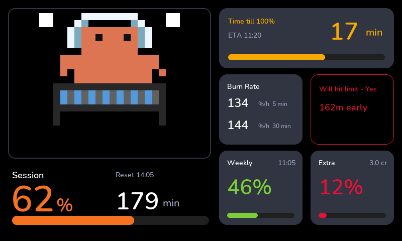
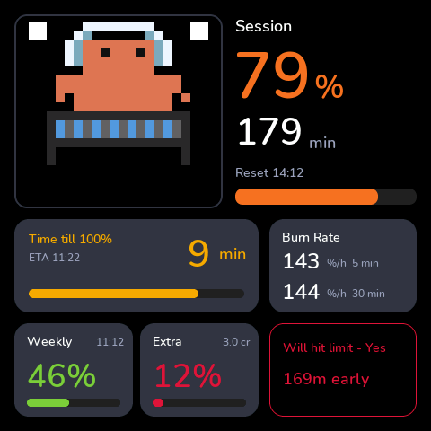
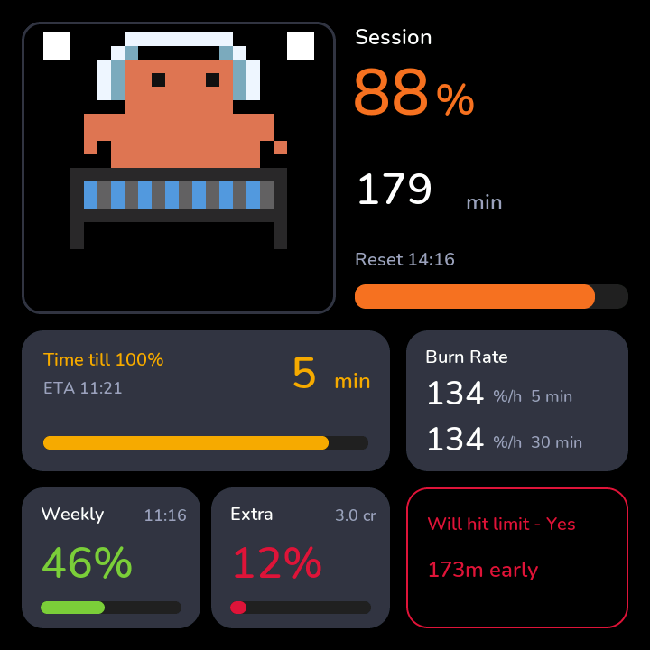
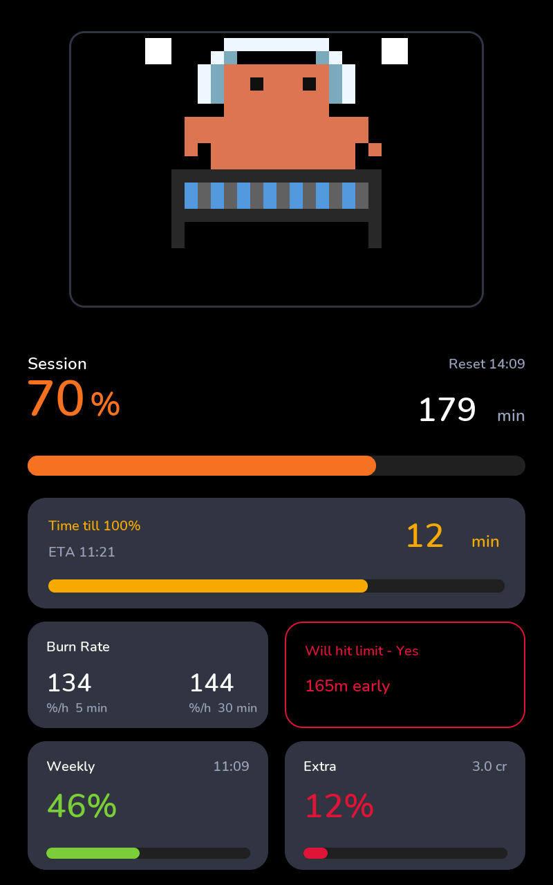
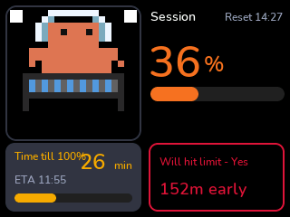
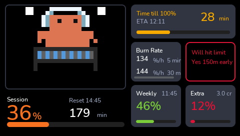
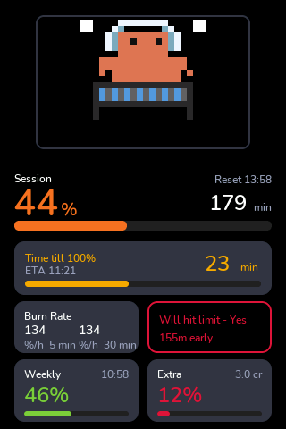
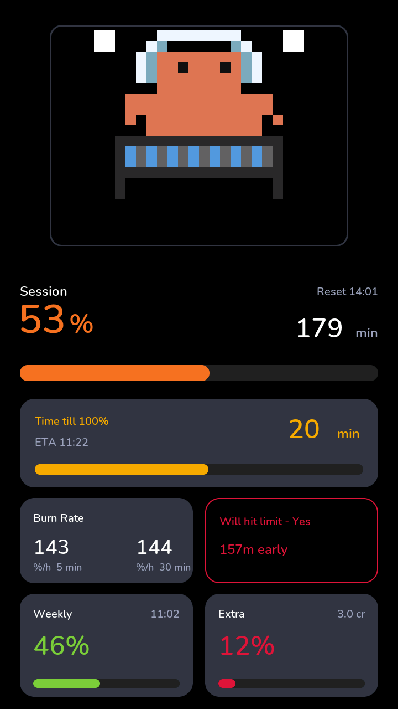

# Clawdmeter — animated Claude token-usage display

ESPHome port of [Clawdmeter](https://github.com/HermannBjorgvin/Clawdmeter). Shows
Claude token usage as a pixel-art creature whose animation changes with how fast
you are burning tokens, plus session/weekly usage and reset times shown as two
severity-coloured horizontal usage bars with text — like the original Clawdmeter
display.

The layout is fully resolution-agnostic: the page is split into a top creature
region and a bottom stats panel, both sized by percentage. The engine measures
the creature region at boot and fits a square pixel-art canvas into it, so the
creature scales correctly on every supported display (170×320 → 800×1280) and
both orientations — no hardcoded pixels.

The original firmware pulled usage over BLE from a Python daemon. This port drops
the daemon: it reads usage from **Home Assistant sensors** via the repo's
`remote` transport (the `homeassistant` platform). Feed those sensors from
whatever scrapes your usage (HA template sensor, REST sensor, the
[ccusage](https://github.com/ryoppippi/ccusage) exporter, etc.).

## Examples

Ready-to-flash device configs live in
[`example_code/clawdmeter/`](../../example_code/clawdmeter/). Copy the closest
one, change the entity IDs in the `substitutions:` block, pick a language pack,
and flash:

| Example | Layout |
|---|---|
| [`grid/…-jc4880p443.yaml`](../../example_code/clawdmeter/grid/guition-esp32-p4-jc4880p443.yaml) | Modular grid tiles, **landscape** (creature left, stats right) — incl. the [pace frame](#pace-frame-pace_frameyaml) |
| [`grid/…-jc4880p443-portrait.yaml`](../../example_code/clawdmeter/grid/guition-esp32-p4-jc4880p443-portrait.yaml) | Modular grid tiles, **portrait** (creature top, stats below), `design: modern` — **the live device**. Incl. the [pace frame](#pace-frame-pace_frameyaml) |
| [`all-in-one/…-jc4880p443.yaml`](../../example_code/clawdmeter/all-in-one/guition-esp32-p4-jc4880p443.yaml) | All-in-one full-screen `remote.yaml` |

See [Usage](#usage) for the minimal include, [Designs and multi-format
layouts](#designs-and-multi-format-layouts) for the `classic`/`modern` page-1
looks and the nine modern formats, and [Data flow](#data-flow) for how the
pieces fit together.

## All-in-one vs. modular grid

There are two ways to assemble the Clawdmeter. Pick by the trade-off between *how
little you wire* and *how much it computes and shows*.

| | **All-in-one** (`remote.yaml`) | **Modular grid** (individual tiles) |
|---|---|---|
| **Include** | one super-include (`uid: clawd`) | ~12 tile includes (`engine.yaml` once, then `creature.yaml`, `usage_rate.yaml`×2, `time_to_100.yaml`, `session_reset_clock.yaml`×2, `runway.yaml`, `pace_frame.yaml`, `stats_panel.yaml`, `anim_select.yaml`) |
| **Layout** | fixed two-region split — creature on top, stats below — sized by **percentage**, so it fits any resolution and both orientations with no cell wiring | explicit `layout: 4x4` grid; **you** place each tile with `row`/`column`/`*_span` → one config per orientation (landscape **and** portrait variants) |
| **HA inputs** | thin **5-entity** [data contract](#home-assistant-data-contract): session/weekly % + two reset timestamps + a status line | **6 raw `ha_*` entities** (adds extra-usage % + credits) in one block at the top of the device YAML |
| **What it shows** | creature + session/weekly usage bars + reset countdowns + status | everything in all-in-one **plus** burn rate (5 m/30 m), time-to-100 % + ETA clock, the [Runway](#runway-runwayyaml--runway_tileyaml) verdict, the breathing [pace frame](#pace-frame-pace_frameyaml), extra-usage bar and an animation picker |
| **Computed on device** | the animation only (from `session_pct`) | the animation **plus** burn rate, time-to-100, Runway pace ratio — each its own package, all also exposed as device/HA entities |
| **Square displays** | optional 2-page split via `stats_page_id` (creature page + stats page) | — |
| **Best for** | the quickest drop-in: one include, any resolution, both orientations, minimal HA wiring | a full dashboard where you want every derived metric, the on-display Runway line and the colour-coded pace frame |

The Runway line and the pace frame ship **only** on the grid builds — the
all-in-one layout doesn't compute a pace ratio. The live device is the
grid-portrait example.

## Designs and multi-format layouts

The grid build's **page-1 look** is chosen at **compile time** by a single
`design:` substitution in the device config — the build pulls the matching
layout file via a dynamic include:

```yaml
substitutions:
  design: modern   # classic | modern | modern_landscape | modern_square | modern_720 | modern_1280 | modern_320x240 | modern_320x480 | modern_480x272 | modern_720x1280

packages:
  clawd_layout: !include
    file: esphome-modular-lvgl-buttons/ui/clawdmeter/layout_${design}.yaml
```

Two design families:

- **`classic`** (`layout_classic.yaml`) — the original creature-on-top,
  stats-panel-below look described above.
- **`modern`** — a dark "card" redesign that ships in **nine pixel-tuned
  formats**, one layout file per resolution/orientation. They are deliberately
  **not** responsive: each file is hand-tuned for its format, but all carry the
  **same widget IDs and the same refresh contract**, so the engine, sensors and
  scripts are identical across formats — only the geometry differs. The smallest
  format (320×240) is a **compact reduced** variant — it drops the weekly/extra
  rows that won't fit and shows the core session card set.

| `design:` value | Layout file | Resolution | Example board (shipped config) |
|---|---|---|---|
| `modern` | `layout_modern.yaml` | 480×800 portrait | Guition ESP32-P4 JC4880P443 (portrait) — **the live device** |
| `modern_landscape` | `layout_modern_landscape.yaml` | 800×480 landscape | Guition ESP32-P4 JC4880P443 (landscape) |
| `modern_square` | `layout_modern_square.yaml` | 480×480 square | Guition ESP32-S3-4848S040 |
| `modern_720` | `layout_modern_720.yaml` | 720×720 square | Waveshare ESP32-P4-86-Panel |
| `modern_1280` | `layout_modern_1280.yaml` | 800×1280 portrait | Guition ESP32-P4 JC8012P4A1 |
| `modern_320x240` | `layout_modern_320x240.yaml` | 320×240 landscape · **compact** | Sunton ESP32-2432S028 |
| `modern_320x480` | `layout_modern_320x480.yaml` | 320×480 portrait | Guition ESP32-JC8048W535 |
| `modern_480x272` | `layout_modern_480x272.yaml` | 480×272 landscape | Guition ESP32-JC4827W543 |
| `modern_720x1280` | `layout_modern_720x1280.yaml` | 720×1280 portrait | Waveshare ESP32-P4 WiFi6 Touch LCD 7 |

All nine formats ship as ready-to-flash grid device configs in
[`example_code/clawdmeter/grid/`](../../example_code/clawdmeter/grid/) (the
480×800 portrait is the live device); point any other board's grid config at a
format by setting `design:`. All nine are rendered headless in the
[SDL preview](../../example_code/clawdmeter/sdl_tests/) (`sdl_modern*` harnesses)
on every layout change.

### Modern layouts at a glance

| modern · 480×800 | modern_landscape · 800×480 | modern_square · 480×480 |
|:---:|:---:|:---:|
|  |  |  |

| modern_720 · 720×720 | modern_1280 · 800×1280 |
|:---:|:---:|
|  |  |

| modern_320x240 · 320×240 (compact) | modern_480x272 · 480×272 |
|:---:|:---:|
|  |  |

| modern_320x480 · 320×480 | modern_720x1280 · 720×1280 |
|:---:|:---:|
|  |  |

> Screenshots are the SDL desktop renders driven by a synthetic usage feed — see
> [`sdl_tests/`](../../example_code/clawdmeter/sdl_tests/).

## Data flow

Where the data comes from, what the device computes, and when which animation is
shown — for both builds (see the [comparison above](#all-in-one-vs-modular-grid)).

### 1. Where the entities come from

The Clawdmeter does **not** scrape Claude itself — it reads usage from **Home
Assistant sensors**. You need a producer for those sensors first, one of:

- **[trickv/hass-claude-usage](https://github.com/trickv/hass-claude-usage)** —
  an HA integration that polls Claude usage and exposes it as a "Claude Usage"
  device, **or**
- **your own implementation** — any HA template / REST / MQTT sensor that
  produces the same usage % + reset-timestamp values.

The **modular grid** build points at six raw entities in one block at the top of
the device YAML — the *only* thing you edit (every `ui/clawdmeter/*` file
receives them via `vars:`):

| Entity (grid build) | Type | Meaning | Feeds |
|---|---|---|---|
| `ha_session_usage` | 0–100 % | session limit used | **animation** + burn rate + time-to-100 + Runway + bar |
| `ha_week_usage` | 0–100 % | weekly limit used | weekly bar |
| `ha_extra_usage` | 0–100 % | extra usage (may be off in HA) | extra bar |
| `ha_extra_credits` | number | extra usage in credits | extra line |
| `ha_session_reset` | ISO-8601 ts | instant the session resets | reset clock + "reset in" + Runway |
| `ha_weekly_reset` | ISO-8601 ts | instant the weekly limit resets | weekly reset clock |

(The all-in-one `remote.yaml` reads a thinner five-entity set — see the
[data contract](#home-assistant-data-contract).)

### 2. What's computed on the device

The raw HA inputs are deliberately thin (percentages + two timestamps).
**Everything else is computed on the ESP**, so the panel keeps working between HA
updates and needs no extra HA template sensors. Each calculation is its own
modular tile package:

```
HA raw inputs                          on-device packages (computed)
─────────────                          ─────────────────────────────
ha_session_usage % ──┬──► usage_rate.yaml ──► burn rate 5m  (clawd_burn5_rate)
                     ├──► usage_rate.yaml ──► burn rate 30m (clawd_burn30_rate)
                     │                              │
                     ├──► time_to_100.yaml ◄────────┘  ──► "time to 100%" + ETA clock
                     │       (100 - usage) / burn * 60
                     │
                     └──► creature.yaml  ──► animation group (see §3)

ha_session_reset ──► session_reset_clock.yaml ──► reset wall-clock "HH:MM"
                         (ISO → minutes via tz)      + "reset in N min" (clawd_reset_reset_in_min)

burn30 + reset_in ──► runway.yaml ──► verdict ("No · Nm to spare"/"Yes · Nm early"/"No") + pace ratio
                                              │
                         pace ratio ─────────┴──► pace_frame.yaml ──► creature-tile border colour
                            (grid layouts only; green / orange / red, optional)
```

- **`usage_rate.yaml`** — ring buffer of `session_pct` samples → **rate in
  %/min** over a trailing window. Included twice: a fast **5 min** window and a
  smooth **30 min** window (the latter feeds the projections).
- **`time_to_100.yaml`** — `T_limit = (100 − usage) / burn30 × 60` min, plus an
  ETA wall-clock. `burn ≤ 0` → "not climbing".
- **`session_reset_clock.yaml`** — ISO reset instant → local wall-clock + "reset
  in N min" countdown (device timezone). Included twice (session + weekly).
- **`runway.yaml`** — folds the two predictions into one verdict (see the
  [Runway](#runway-runwayyaml--runway_tileyaml) section).
- **`stats_panel.yaml`** — reads the four percentages + credits from HA and every
  derived value above **by id**, and draws the bars / burn line. The inline Runway
  line is off by default (`show_runway: "true"` to enable).

### 3. When which animation is shown

The creature's mood tracks **how fast you're burning tokens**, not the absolute
percentage: the engine computes the burn rate from `session_pct` and maps it to
one of four animation groups (faster burn → livelier group), with a warm-up
guard right after boot/reset. The full group table is in
[Usage → animation mapping](#usage--animation-mapping) below.

## Files

| File | Purpose |
|---|---|
| `remote.yaml` | The **all-in-one** component: HA sensors, LVGL chrome (canvas + usage bars + labels), animation driver. Include this from a device config. |
| `engine.yaml`, `creature.yaml`, … (the modular tile packages + `*_tile.yaml` wrappers) and `lang/{en,de,es,fr}.yaml` | The **modular grid** building blocks — one include per tile, placed into grid cells (see the [comparison table](#all-in-one-vs-modular-grid)) — plus the language packs. |
| `layout_classic.yaml`, `layout_modern*.yaml` | Page-1 **layout** files selected by the `design:` substitution — `classic` (creature + stats panel) and the nine `modern` formats. See [Designs and multi-format layouts](#designs-and-multi-format-layouts). |
| `charts_page.yaml` | Optional, design-agnostic **charts page** — usage/credits history graphs, sampled every `chart_sample_min` minutes (90-sample ring, ~12 h). |
| `clawdmeter_engine.h` | Header-only render + usage-rate engine, pulled in via `esphome.includes`. Exposes a small C API. |
| `splash_animations.h` | Vendored, generated pixel-art animation data (13 animations, 20×20 grid, RGB565 palette). |
| `tests/test_usage_rate.cpp` | Host (g++) unit test for the usage-rate state machine. |
| `tests/test_convert_counts.js` | Node parity test: header animation count matches the source index. |

## Home Assistant data contract

`remote.yaml` reads these entities. Override the defaults with the matching
`*_entity` vars at include time.

| Var | Default entity | Type | Meaning |
|---|---|---|---|
| `session_pct_entity` | `sensor.SET_ME_session_usage` | 0–100 | % of the current session limit used. **Drives the animation.** |
| `session_reset_entity` | `sensor.SET_ME_session_reset_time` | ISO-8601 timestamp | Instant the session limit resets, e.g. `2026-06-17T06:30:00+00:00`. |
| `weekly_pct_entity` | `sensor.SET_ME_week_usage` | 0–100 | % of the weekly limit used. |
| `weekly_reset_entity` | `sensor.SET_ME_weekly_reset_time` | ISO-8601 timestamp | Instant the weekly limit resets. |
| `status_entity` | `sensor.SET_ME_status` | text | Free-form status line shown at the bottom. |

The `*_reset_entity` sensors carry the next reset **instant** as an ISO-8601 UTC
string; the device converts it to minutes-from-now on-device via
`clawd_iso_minutes_from()` (needs a time component with id `system_time`). The
countdown is formatted as `resets in Hh MMm` (session) and `resets in Dd HHh`
(weekly), and is omitted when the timestamp is missing/unparseable. Only
`session_pct` feeds the rate machine; the rest are display-only.

### Optional layout / colour vars

| Var | Default | Meaning |
|---|---|---|
| `clawd_creature_h` | `60%` | Height of the top creature region. |
| `clawd_stats_h` | `38%` | Height of the bottom stats panel. |
| `clawd_bar_low` | `0x43A047` (green) | Bar fill colour when `< 50%`. |
| `clawd_bar_mid` | `0xFFB300` (amber) | Bar fill colour `50–80%`. |
| `clawd_bar_high` | `0xE53935` (red) | Bar fill colour `≥ 80%`. |

## Usage → animation mapping

`clawdmeter_engine.h` keeps a ring buffer of recent `session_pct` samples and
computes a usage **rate** (% per minute) over the window. The rate selects an
animation group; within a group the engine rotates through its animations every
20 s. A drop in `session_pct` of more than 5 points is treated as a session
reset and clears the window.

| Group | Rate (%/min) | Mood | Example animations |
|---|---|---|---|
| 0 idle | warming up / `< 0.10` | calm | sleep, idle breathe, blink, wink |
| 1 normal | `0.10 – 0.20` | working | look around, think, coding |
| 2 active | `0.20 – 0.33` | busy | sway, surprise, bounce |
| 3 heavy | `≥ 0.33` | maxed | bounce DJ, sway DJ, djmix |

The window needs at least 2 samples spanning ≥ 2 minutes before it leaves idle,
so the creature stays calm right after boot or a reset.

## Runway (`runway.yaml` + `runway_tile.yaml`)

A bottom-line verdict that folds the two predictions the Clawdmeter already
computes into one answer: **does the session reset before usage hits the limit
(safe), or does it run into the limit first (over)?**

```
T_reset = minutes until the session reset      (session_reset_clock.yaml "reset in")
T_limit = (100 - usage) / burn * 60   [min]    (same calc as time_to_100.yaml)

T_reset <= T_limit -> resets first      -> "No · <slack>m to spare"
T_limit <  T_reset -> hits limit first  -> "Yes · <deficit>m early"
burn <= 0          -> not climbing      -> "No"
inputs missing     ->                   -> "unknown" (keeps last good value)
```

`runway.yaml` is a backend package (no LVGL): it exposes the verdict as a text
sensor (`name:` → Home Assistant / ESPHome dashboard) plus a numeric **pace
ratio** `T_reset / T_limit` (`> 1` = burning fast enough to hit the limit that
many times over before the reset). It needs no `engine.yaml` — pure ESPHome.
`stats_panel.yaml` can draw the same verdict inline (prefixed **"Hit limit? "**,
e.g. `Hit limit? No · 34m to spare`) from its own ids, but the
line is **off by default** — set `show_runway: "true"` on the panel to show it
(the grid-portrait example does). The verdict is always computed regardless; this
only toggles the on-display line. Add `runway_tile.yaml` only if you also want it
as its own LVGL grid cell.

Wire it to the SAME 30m burn-rate and "reset in" sensors the rest of the
Clawdmeter uses:

```yaml
clawd_rw: !include
  file: esphome-modular-lvgl-buttons/ui/clawdmeter/runway.yaml
  vars:
    uid: clawd_rw
    rate_id: clawd_burn30_rate            # from usage_rate.yaml (window_min: 30)
    resetin_id: clawd_reset_reset_in_min  # from session_reset_clock.yaml
    source_entity: $ha_session_usage
```

| Var | Required | Meaning |
|---|---|---|
| `uid` | yes | namespace prefix for the exposed ids (`${uid}_runway`, `${uid}_runway_ratio`) |
| `rate_id` | yes | id of the 30m burn-rate sensor |
| `resetin_id` | yes | id of the "reset in" minutes sensor |
| `source_entity` | no | HA usage % sensor (default `sensor.SET_ME_session_usage`) |
| `name` / `ratio_name` | no | entity names for the verdict / pace sensors |
| `update_sec` | no | recompute cadence (default 30) |

Localized via the `t_runway_*`, `t_fmt_runway`, `t_ph_runway`, `t_name_runway*`
and `t_tile_runway` keys (see `lang/en.yaml`).

> **Session only.** A weekly Runway would need a multi-hour weekly burn-rate
> sensor; the current `usage_rate.yaml` ring (≈40 min) can't supply one yet.

> **Caveat:** the burn rate is a short trailing window (bursty), so Runway is an
> "if you keep this exact pace up" projection, not a guarantee.

## Pace frame (`pace_frame.yaml`)

An optional colour-coded **breathing border** around the creature tile, fed by
the Runway **pace ratio** above. It turns the creature's own frame into an
at-a-glance status light: the calmer the runway, the calmer the frame.

```
pace ratio (clawd_rw_runway_ratio) ──► pace_frame.yaml ──► creature-tile border
   no value       -> no border
   ratio <  0.90  -> green  (0x43A047)  head-room     — solid, never breathes
   ratio <  1.00  -> orange (0xFFB300)  cutting close — breathes (slow)
   ratio >= 1.00  -> red    (0xE53935)  at/over limit — breathes (fast)
```

It's **pure YAML** — no engine or C++ change. It only restyles an *existing*
LVGL tile (the creature's outer tile, `${creature_uid}_creature_root`), so it
needs both a `runway.yaml` include (for the ratio) and the modular `creature.yaml`
tile (for the target). That's why it ships only on the two **modular grid**
examples — [landscape](../../example_code/clawdmeter/grid/guition-esp32-p4-jc4880p443.yaml)
and [portrait](../../example_code/clawdmeter/grid/guition-esp32-p4-jc4880p443-portrait.yaml).
The all-in-one `remote.yaml` builds don't compute a pace ratio, so they can't use it.

```yaml
clawd_pace_frame: !include
  file: esphome-modular-lvgl-buttons/ui/clawdmeter/pace_frame.yaml
  vars:
    uid: clawd_pf
    ratio_id: clawd_rw_runway_ratio    # ${runway_uid}_runway_ratio from runway.yaml
    target_id: clawd_c_creature_root   # ${creature_uid}_creature_root from creature.yaml
    show_from: "orange"                # both examples ship this: hide the calm green frame
```

| Var | Required | Meaning |
|---|---|---|
| `uid` | yes | namespace prefix for this include's ids + switch |
| `ratio_id` | yes | id of the pace-ratio sensor (`${runway_uid}_runway_ratio`) |
| `target_id` | yes | id of the LVGL tile to frame (`${creature_uid}_creature_root`) |
| `enabled` | no | `"false"` compiles the logic to a no-op (default `"true"`) |
| `width` | no | border thickness in px (default `3`) |
| `green_max` / `orange_max` | no | band thresholds (default `0.90` / `1.00`) |
| `show_from` | no | lowest band that draws: `"green"` (default, all bands) / `"orange"` (warn from orange up) / `"red"` (only at/over the limit) |
| `breathe_*` | no | pulse tuning: `breathe_ms_slow` (1400) / `breathe_ms_fast` (700) half-periods, `breathe_min_opa` (60) dim floor, `breathe_default` (`"true"`) |

**The whole frame is runtime-toggleable.** An exposed switch — `name:`
**"Pace Frame"** (`breathe_switch_name`), object id `${uid}_pace_breathe_sw` —
is a *visibility master*, not just a pulse toggle: switch **off** hides the
**entire** frame (no border at all); switch **on** shows it — orange/red
breathing, green solid. Green never breathes either way. Toggle it live from
Home Assistant without a reflash.

> **Default-off elsewhere.** Configs that don't include `pace_frame.yaml` are
> unaffected. Drop the include (or set `enabled: "false"`) to remove the frame.

## Engine C API (`clawdmeter_engine.h`)

| Function | Purpose |
|---|---|
| `clawd_init(lv_obj_t* parent, int w, int h)` | Create the creature canvas on `parent`. The canvas is sized from `parent`'s *measured* content box (resolution-agnostic); `w`/`h` are only a fallback if the layout isn't resolved yet. Call from `on_boot` (priority `-100`, after LVGL is up). |
| `clawd_tick()` | Advance the animation. Call from a 50 ms `interval`. |
| `clawd_set_usage(session_pct, session_reset_mins, weekly_pct, weekly_reset_mins)` | Feed a new sample; only `session_pct` is used. Call from the session sensor's `on_value`. |
| `clawd_usage_sample(float)` / `clawd_usage_group()` | Lower-level sampler / current group accessor (used by the host test). |

> Do **not** add C++ accessor functions named after the HA sensor IDs
> (`clawd_session_pct`, `clawd_weekly_pct`, …): ESPHome generates global objects
> with those exact names from the `id:` fields, and they would collide.

## Usage

Add to a device config (see
`example_code/clawdmeter/all-in-one/guition-esp32-p4-jc4880p443.yaml`):

```yaml
packages:
  clawdmeter: !include
    file: esphome-modular-lvgl-buttons/ui/clawdmeter/remote.yaml
    vars:
      uid: clawd
```

The component extends `main_page` by default; pass `page_id` to attach it to a
different page.

## Building

Standard `esphome compile`. One gotcha: **PlatformIO/ESP-IDF reject build paths
that contain whitespace.** If your checkout sits under a path with a space, build
from a space-free directory — e.g. junction the repo into one:

```powershell
New-Item -ItemType Junction -Path C:\build\esphome-modular-lvgl-buttons `
  -Target "C:\path with space\esphome-modular-lvgl-buttons"
# put the device yaml + secrets.yaml next to the junction, then: esphome compile clawd.yaml
```

## Tests

```bash
# usage-rate state machine (host build)
g++ -std=c++17 ui/clawdmeter/tests/test_usage_rate.cpp -o /tmp/urt && /tmp/urt

# animation-data parity
node ui/clawdmeter/tests/test_convert_counts.js
```

## Credits & license

The Clawdmeter is part of the
[**esphome-modular-lvgl-buttons**](https://github.com/agillis/esphome-modular-lvgl-buttons)
library and ships under its **MIT license** (see [LICENSE](../../LICENSE)).

| Project | Role |
|---|---|
| [HermannBjorgvin/Clawdmeter](https://github.com/HermannBjorgvin/Clawdmeter) | Original Clawdmeter — creature concept and pixel-art animations this port is based on. |
| [agillis/esphome-modular-lvgl-buttons](https://github.com/agillis/esphome-modular-lvgl-buttons) | Upstream modular LVGL button library this component lives in. |
| [trickv/hass-claude-usage](https://github.com/trickv/hass-claude-usage) | Reference Home Assistant integration that produces the Claude usage sensors. |

© the respective authors. Pixel-art animation data is vendored from the original
Clawdmeter project under its own terms.
